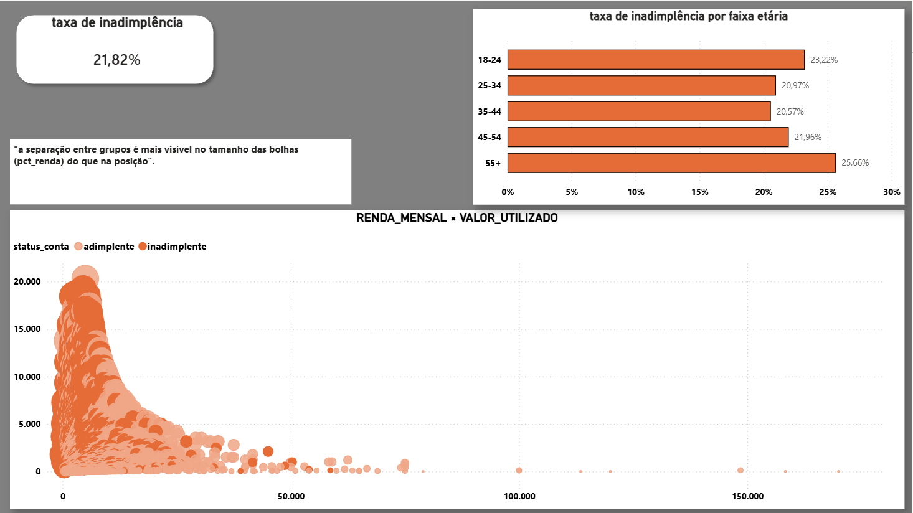
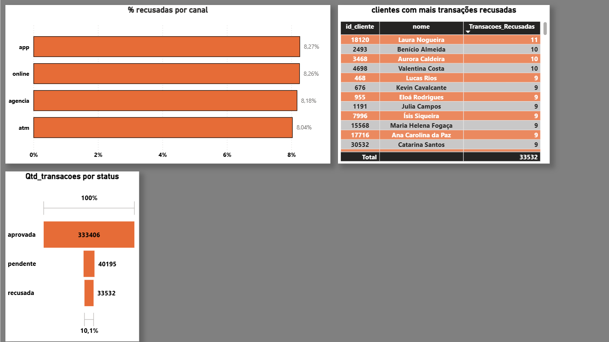

# Análise de Inadimplência e Comportamento de Clientes — BancoX


🔗 **[Acesse o dashboard interativo aqui](https://app.powerbi.com/reportEmbed?reportId=18c69a9b-6c35-4d55-b3cc-3d201f68eb13&autoAuth=true&ctid=6f9e3b1e-1809-444a-81d3-82d40a928812)** 
> ⚠️ **Nota de acesso:** o link requer uma conta Microsoft para visualização, devido às limitações do plano de estudante usado no Power BI. Além disso, o mapa de distribuição por estado (Página 1) não é exibido em relatórios publicados externamente — trata-se de uma restrição de licenciamento da Esri sobre o visual ArcGIS for Power BI, não um erro do relatório. Os prints estáticos abaixo mostram o dashboard completo, incluindo o mapa.

Projeto de análise de dados ponta a ponta: SQL (PostgreSQL) → Python (pandas) → Power BI, aplicado a um problema real do setor financeiro — perfil de risco de crédito e comportamento de gastos de clientes bancários.

**Autor:** Pedro Eduardo de Almeida Farias
**Stack:** PostgreSQL 18 · Python (pandas, SQLAlchemy, Faker, seaborn) · Power BI Desktop
**Base de dados:** [Credit Risk Dataset](https://www.kaggle.com/datasets/laotse/credit-risk-dataset) (Kaggle), enriquecido com dados sintéticos

---

## 1. Problema de negócio

Um banco digital fictício quer entender três coisas:
- Quais perfis de clientes têm maior risco de inadimplência
- Como o comportamento de gastos se relaciona com esse risco
- Onde estão as maiores fricções operacionais (recusas de transação)

## 2. Pipeline de dados

```
Kaggle (CSV) → Python (limpeza) → PostgreSQL (schema + carga) → SQL (extração) → Python (análise) → Power BI (dashboard)
```
 
O dataset original do Kaggle cobre só uma parte do escopo (dados de crédito), então parte da base foi **gerada sinteticamente com Faker** para completar o modelo — isso é declarado explicitamente ao longo deste documento sempre que relevante, porque muda como um resultado deve ser interpretado.

## 3. Modelo de dados (star schema)

| Tabela | Tipo | Origem | Conteúdo |
|---|---|---|---|
| `dim_clientes` | Dimensão | Dataset real + Faker | Dados demográficos (`renda_mensal`, `estado`, `data_nascimento` vêm do dataset; `nome`, `cpf`, `cidade`, `data_cadastro` são sintéticos) |
| `dim_categorias` | Dimensão | Dataset real | 6 categorias de intenção de crédito (`loan_intent` traduzido) |
| `fato_contas` | Fato | Dataset real | Uma linha por cliente: `limite_credito`, `taxa_juros`, `grau_risco`, `pct_renda`, `valor_utilizado`, `status_conta` |
| `fato_transacoes` | Fato | 100% sintética (Faker) | 407.133 transações individuais, geradas de forma coerente com o perfil de risco de cada cliente |

**Volume final:** 32.572 clientes · 32.572 contas · 407.133 transações

## 4. Tratamento de dados (Python)

Problemas reais encontrados no dataset do Kaggle e como foram tratados:

| Problema | Tratamento | Justificativa |
|---|---|---|
| `person_age` com outliers (até 144 anos) | Remoção de 9 registros (> 80 anos) | Erros de digitação, sem valor correto pra imputar |
| `loan_int_rate` com 9,6% de nulos | Imputação pela **mediana por grau de risco** (`loan_grade`) | Correlação de 0,934 entre grade e taxa — imputar pela mediana global distorceria o risco |
| `person_emp_length` com 2,7% de nulos + outliers | Imputação pela mediana global | Variação entre grupos é pequena (3-5 anos), não justifica segmentação |
| Encoding `Y`/`N` em `cb_person_default_on_file` | Convertido para booleano | Padronização |

Resultado: 32.581 → 32.572 linhas, zero nulos remanescentes.

## 5. Perguntas fechadas (SQL)

| # | Pergunta | Resultado |
|---|---|---|
| 1 | Ticket médio por categoria | Melhoria de Imóvel lidera (R$ 978,10); todas as categorias ficam entre R$ 840-980 |
| 2 | Mês com maior volume de transações | Sem pico dominante — os 5 melhores meses variam entre 9.256 e 9.491 transações, diferença de ~2,5% |
| 3 | Taxa de inadimplência por faixa etária | Padrão em "U": 23,0% (18-24) → cai para ~21% (25-54) → sobe para 25,7% (55+) |
| 4 | Top 5 estados por valor médio de transação | PA, MA, ES, MS, PR — nenhum dos grandes centros econômicos (SP/RJ) aparece |
| 5 | % de transações recusadas por canal | Todos entre 8,0% e 8,3% — nenhum canal se destaca como ponto de fricção |
| 6 | Correlação renda × limite de crédito | 0,317 (fraca/moderada); renda × taxa de juros: -0,006 (nula) |

## 6. Perguntas abertas (Python)

### 6.1 — O que diferencia clientes adimplentes de inadimplentes?

**Descritivo:** adimplentes têm renda média 30% maior (R$ 5.879 vs R$ 4.093) e comprometem uma fatia bem menor dela com dívida — `pct_renda` de 20% contra 34% dos inadimplentes.

**Diagnóstico:** `pct_renda` (proporção entre valor do empréstimo e renda anual) separa os dois grupos de forma muito mais nítida que a renda isolada, o que é coerente com a prática real de concessão de crédito. **Ressalva:** como `pct_renda` é parcialmente definicional em relação ao próprio empréstimo, parte dessa relação é esperada por construção, não uma correlação descoberta de forma independente.

### 6.2 — Como o perfil de gastos evolui no ciclo de vida do cliente?

**Resultado:** nenhuma tendência identificada. O valor médio de transação varia menos de 2% entre clientes com 0-1 ano de casa (R$ 865,66) e 3-6 anos (R$ 848,51).

**Limitação declarada:** `data_cadastro` foi gerada sinteticamente sem vínculo com comportamento real — o resultado é o esperado dado como o dado foi construído, e serve como validação de que a análise foi conduzida corretamente, não como um achado de negócio.

### 6.3 — Existe sazonalidade de gastos por categoria?

**Resultado:** não foi identificada sazonalidade real. A variação mês a mês dentro de cada categoria (8% a 15,5%) é consistente com ruído estatístico de dados gerados aleatoriamente — nenhuma categoria se destaca das outras de forma sistemática.

**Nota metodológica:** o heatmap inicial sugeria visualmente um padrão sazonal, mas isso se mostrou um efeito da escala de cor (dominada pelas diferenças de volume *entre* categorias, não pela variação *dentro* de cada uma). Uma métrica numérica de variação percentual por linha foi necessária para desfazer essa leitura equivocada.

## 7. Dashboard (Power BI)

4 páginas, conectadas via **Import** direto ao PostgreSQL, com relacionamentos herdados do star schema:

**Página 1 — Visão Geral:** KPIs (32.572 clientes · 407.133 transações · ticket médio R$ 852,14 · taxa de inadimplência 21,82%), volume por categoria, mapa de distribuição por estado (ArcGIS for Power BI).

**Página 2 — Comportamento de Gastos:** série temporal mensal (confirma visualmente a ausência de sazonalidade — variação de ~3% ao longo do ano), treemap por tipo de categoria (63,4% variável / 36,6% essencial), top 10 clientes por volume.


**Página 3 — Inadimplência:** taxa geral, taxa por faixa etária (reproduz o padrão em "U" encontrado no SQL), gráfico de dispersão renda × valor utilizado com `pct_renda` no tamanho da bolha. **Nota de leitura:** o formato em "cunha" do gráfico reflete a relação matemática entre as variáveis (`valor_utilizado` é derivado de `pct_renda × limite_credito`), não um padrão comportamental descoberto.



**Página 4 — Operacional:** funil de status de transação (aprovada 333.406 · pendente 40.195 · recusada 33.532 → 10,1%), % de recusa por canal (8,0%-8,3%, sem canal problemático), tabela de clientes com mais recusas.



## 8. Limitações do projeto

- `fato_transacoes` é inteiramente sintética — útil para praticar o pipeline completo, mas os achados de comportamento transacional (perguntas 2 e 3) não devem ser lidos como descobertas de negócio reais.
- `pct_renda`/`valor_utilizado` guardam relação matemática direta entre si — correlações envolvendo essas variáveis precisam da ressalva de que parte do sinal é por construção.
- Dataset original tem 21,8% de inadimplência — proporção real e utilizável para análise, mas não validada contra nenhuma fonte de mercado atual.

## 9. Estrutura de arquivos

```
projeto-banco/
├── sql/
│   ├── 01_schema.sql
│   └── 05_queries_perguntas_fechadas.sql
├── python/
│   ├── 02_importar_csv.py
│   ├── 03_limpeza.py
│   └── 04_adaptar_schema.py
├── notebooks/
│   └── Creditrisk.html (perguntas abertas 1, 2 e 3)
├── powerbi/
│   └── dashboard_banco.pbix
└── README.md
```